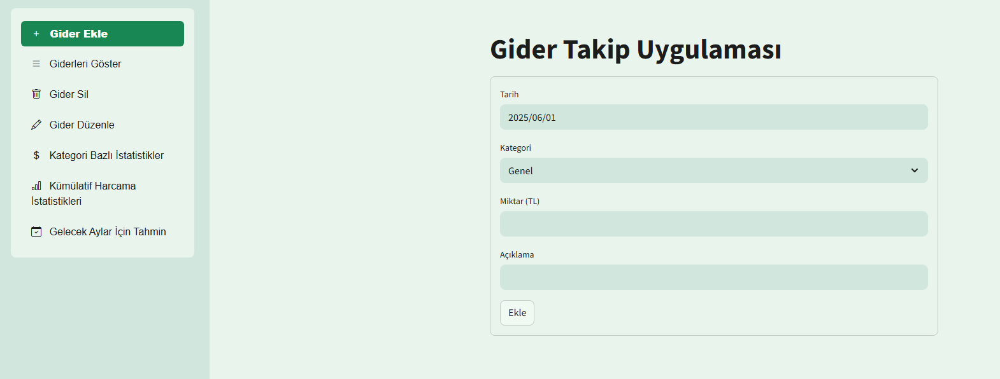

# Gider Takip Uygulaması (Expense Tracking Application)

---

 **İçindekiler / Table of Contents**

- [Giriş / Introduction](#giriş--introduction)  
- [Özellikler / Features](#özellikler--features)  
- [Ekran Görüntüleri / Screenshots](#ekran-görüntüleri--screenshots)  
- [Kurulum / Installation](#kurulum--installation)  
- [Kullanım / Usage](#kullanım--usage)  

---

## Giriş  
Streamlit kullanılarak geliştirilmiş bir gider takip uygulamasıdır. Kişisel veya aile bütçenizi yönetmek, giderlerinizi kategorilere ayırmak ve harcama alışkanlıklarınızı analiz etmek için tasarlanmıştır.

## Introduction  
This is an expense tracking application developed using Streamlit. It is designed to help you manage your personal or family budget, categorize your expenses, and analyze your spending habits.

---

## Özellikler  

-  Gider ekleme, listeleme, düzenleme ve silme  
-  Kategori bazlı istatistikler  
-  Kümülatif harcama trend grafiği  
-  Isı haritası ile kategori bazlı aylık harcama yüzdeleri  
-  Gelecek aylar için gider tahmini (Lineer regresyon ile)  

## Features  

-  Add, list, edit, and delete expenses  
-  Category-based statistics  
-  Cumulative spending trend graph  
-  Monthly spending percentages by category with heatmap  
-  Expense prediction for upcoming months (using linear regression)  

---

## Ekran Görüntüleri  / Screenshoots

>   

---

## Kurulum  

1. Projeyi klonlayın veya indirin:  
```bash
git clone https://github.com/lenthic/gider-takip-app.git
cd gider-takip-app
```  
2. Gerekli paketleri yükleyin:  
```bash
pip install -r requirements.txt
```  

## Installation  

1. Clone or download the project:  
```bash
git clone https://github.com/lenthic/gider-takip-app.git
cd gider-takip-app
```  
2. Install required packages:  
```bash
pip install -r requirements.txt
```  

---

## Kullanım  
Uygulamayı başlatmak için:  
```bash
streamlit run app.py
```  
Arayüzdeki seçenekler:  
- Gider Ekle: Yeni gider kaydedin.  
- Giderleri Göster: Kayıtlı giderleri listeleyin.  
- Gider Sil: İstenmeyen giderleri kaldırın.  
- Gider Düzenle: Giderlerinizi düzenleyin.  
- Kategori Bazlı İstatistikler: Kategori bazında harcama grafiklerini görün.  
- Kümülatif Harcama İstatistikleri: Aylık kümülatif harcamalarınızı takip edin.  
- Gelecek Aylar İçin Tahmin: 6 Aylık harcama tahminini görüntüleyin.  

## Usage  
To start the application:  
```bash
streamlit run app.py
```  
Options in the interface:  
- Add Expense: Record a new expense.  
- Show Expenses: List all recorded expenses.  
- Delete Expense: Remove unwanted expenses.  
- Edit Expense: Edit your expenses.  
- Category-Based Statistics: View spending graphs by category.  
- Cumulative Spending Statistics: Track your monthly cumulative spending.  
- Forecast for Upcoming Months: View 6-month spending predictions.  

---

